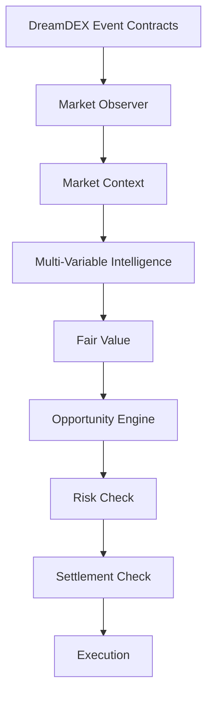

# Sooth
**Know what to trade.**

Sooth watches DreamDEX Event Contracts in real time, analyzes the market from multiple signals, and tells you when a market is worth trading — or when to stay out.

```
DreamDEX Market
      ↓
Market Data
      ↓
Sooth Intelligence
      ↓
Fair Value
      ↓
Opportunity
      ↓
Risk + Settlement
      ↓
TRADE / WATCH / NO TRADE
```

Live: https://sooth-gray.vercel.app · Testnet only · No real money.

---

## 1. What is Sooth?

Prediction markets make choosing a direction easy. The difficult part is knowing whether the current price actually presents a good opportunity.

Sooth solves that. It reads the live order book, the underlying asset, recent history, and time to expiry, combines them into one fair-value estimate, subtracts real execution costs, and returns a decision: TRADE, WATCH, or NO TRADE — with reasons that cite actual numbers.

## 2. How It Works

Observe → Analyze → Estimate → Check → Decide → Execute.

1. **Observe.** Poll live Event Contract markets, order books, underlying prices, and snapshots.
2. **Analyze.** Compute nine real variables: price, spread, imbalance, depth, underlying move, momentum, volatility, time to expiry, strike distance (or N/A where the data doesn't support it).
3. **Estimate.** Combine them into a fair value (0–1 probability). Every contributor's math is visible.
4. **Check.** Subtract spread and slippage costs. Run settlement verification.
5. **Decide.** TRADE (executable edge ≥ 0.02), WATCH (real edge, not executable), NO_TRADE (with the specific blocker named).
6. **Execute.** Only TRADE candidates reach risk, and risk can still say no.

## 3. Example

From `npm run decision:demo` (synthetic books, labeled in output):

```
ETH UP
Market price: 54¢
Sooth estimate: 59¢

Decision: TRADE

Why:
- TRADE UP: executable edge +0.0441 ≥ minEdge 0.0200
- order-flow imbalance 0.905 × k=0.060 → +0.0543 (supports UP)
- opportunity 90/100
```

```
ETH DOWN
Market price: 54¢
Sooth estimate: 54¢

Decision: NO_TRADE

Why:
- NO_TRADE: edge +0.0000 < watch bar 0.0100
- order-flow imbalance 0.000 (supports FLAT)
```

Live backtest on 50 real settled markets: 0 trades taken, 50 NO_TRADE, rejection `spread=50`, P&L +0.0000. The engine refused every market and said so plainly.

## 4. Why Sooth Is Different

Most Event Contract systems can identify a direction. Sooth evaluates whether the opportunity is strong enough to justify execution.

One pipeline, not seven strategies: order flow, liquidity, momentum, volatility, time, underlying movement, and repricing gap all feed a single fair value, a single executable edge, and a single 0–100 score. A good signal that cannot survive spread, slippage, risk, and settlement becomes WATCH or NO_TRADE — never a quiet fill.

## 5. Architecture



Physical layout (kept working, mapped to the model above):

| Concept | Lives here |
|---|---|
| Market Observer | `src/api/` (Fastify routes), `src/snapshots/` (logger + SQLite) |
| Market Context | `src/analysis/variables.ts`, `src/analysis/referenceFeed.ts` |
| Intelligence | `src/analysis/contextEngine.ts`, `src/analysis/dislocation.ts` |
| Fair Value | `contextEngine.computeFairValue` |
| Opportunity + Decision | `src/analysis/decision.ts` |
| Risk Check | `src/risk/riskEngine.ts` (10 checks, untouched) |
| Settlement Check | `src/analysis/settlementGate.ts` |
| Execution | `src/ec/orderLifecycle.ts`, `src/bot/runner.ts` |
| Backtest | `src/backtest/` (engine + history + decision report) |
| Web app | `frontend/` (React + Vite, consumes decision output) |
| Chain kit (read-only dep) | `vendor/dreamdex-bot-kit` (never edited) |

## 6. Intelligence Model

| Variable | Source | Role |
|---|---|---|
| Market price / mid | Order book | Baseline fair value starts here |
| Bid/ask spread | Book | Cost penalty + gate |
| Order-book imbalance | Book, Stage 3 formula | `k × imbalance` tilt |
| Depth / liquidity | Book | Slippage penalty + gate |
| Underlying movement | Price feed (27 assets) | Repricing gap input |
| Momentum | Snapshot history (rate of change) | Bounded contributor, N/A when history thin |
| Volatility | Snapshot history (stddev) | Reported context, not weighted (non-directional) |
| Time to expiry | On-chain | Gate + risk component |
| Strike distance | Strike + reference | N/A on real markets (strike is 0), never invented |

`fairValue = clamp(market + tilt + momentum + dislocation)`. Penalties are computed (half-spread + size/liquidity slippage), never a vague discount. See `docs/strategy.md`.

## 7. Risk & Settlement

Good signal ≠ automatic trade. A signal must survive edge → execution → liquidity → risk → settlement.

Risk (`src/risk/riskEngine.ts`, 10 checks: position size, exposure, max loss, liquidity floor, spread cap, duplicate orders, stale data, abnormal spread, edge floor, balance) can reject an attractive opportunity. Settlement verification blocks anything whose event, expiry, or on-chain resolution state is unreadable: `TRADE BLOCKED - SETTLEMENT RISK`. Strike is informational — real markets usually lack it.

## 8. Backtesting

Measures the decision framework, not just P&L. Per settled market, per snapshot: decisions evaluated, TRADE/WATCH/NO_TRADE counts, rejection reasons by category, predicted vs actual outcome, realized edge, P&L, win rate.

Latest real run (`npm run backtest`, 50 settled markets): 0 trades, `spread=50` rejections, +0.0000 tUSDC, win rate N/A. Only real metrics are reported — see `docs/decisions.md`.

## 9. Tech Stack

Fastify 4 · TypeScript (strict) · SQLite/WAL via better-sqlite3 · viem · `@somnia-chain/markets-sdk@0.28.1` · local `dreamdex-bot-kit` (file dependency) · React 19 + Vite + ECharts · esbuild serverless bundle · Vercel. Nothing else. No LLMs, no sentiment feeds, no extra providers.

## 10. Running Locally

```bash
git clone https://github.com/Shaydez-Defi/sooth
cd sooth
npm install
cp .env.example .env
npm run api          # backend on :3000
cd frontend && npm install && npm run dev   # app on :5173
```

Checks: `npm run typecheck`, `npm run lint`, `npm test` (122 tests). Demo both decisions: `npm run decision:demo`.

## 11. Testnet

- Network: Somnia Shannon testnet, chain 50312. RPC `https://dream-rpc.somnia.network`. Indexer `https://dev.smk.somnia.host/v1/graphql`.
- Protocol: DreamDEX Event Contracts (binary YES/NO pools, tUSDC collateral). Venue `0x679795a0195a1b76cdebb7c51d74e058aee92919b8c3389af86ef24535e8a28c`.
- Wallet: browser injected wallet (MetaMask, Rabby) or `WALLET_PRIVATE_KEY` for scripts. The app switches you to chain 50312 automatically.
- Funds: STT for gas (faucet: `https://testnet.somnia.network`), tUSDC for collateral. Trade from a dedicated wallet you fund separately. Never commit a real key.
- Run safely: start read-only (`npm run discover:ec`, `npm run analyze`), paper-check the bot (`npm run bot:smoke`), then fund small.

## 12. Demo

1. Open Sooth.
2. A live market appears (e.g. `ETH-0-04SEP26-0040/tUSDC`).
3. Market shows price, spread, depth, time to expiry.
4. Sooth evaluates it: fair value, raw edge, executable edge, score.
5. Show TRADE or NO_TRADE (e.g. `npm run decision:demo` shows both on demand).
6. Show the explanation: per-variable contributions and gate checks.
7. If TRADE → place the order from the detail screen.
8. Show the receipt: tx hash, block, fill state.
9. Show monitoring: bot ticks, events, positions, P&L.

## 13. Hackathon

Built for the Somnia × DreamDEX Event Contracts Hackathon, using: Event Contract discovery (`activeMarkets`), live order-book reads, real place/cancel order lifecycle on testnet, underlying price feeds, and finalized-outcome backtesting. Venue-scoped throughout; nothing touches mainnet.

License: MIT.
